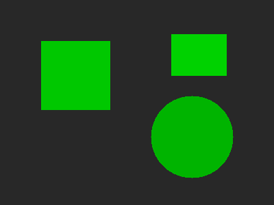
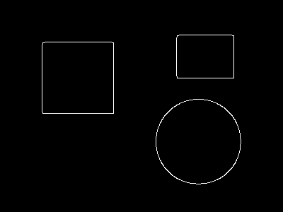
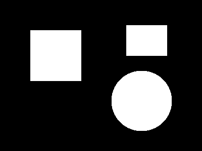
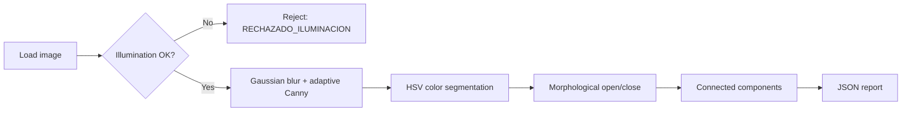

# Industrial Vision Inspector

[](https://github.com/apolomz/industrial-vision-inspector/actions/workflows/tests.yml)


[](LICENSE)

A modular, tested computer vision pipeline that simulates an **automated visual quality-inspection station** for a production line. It audits illumination, detects edges, segments parts by color, measures connected components, and emits a structured JSON report — the same kind of pass/fail signal a real machine-vision station would send to a PLC or MES system.

> ⚠️ This is a portfolio/educational project. Thresholds and color ranges are tuned for synthetic demo images, not calibrated for a real production line.

<p align="center">
  
  
  
</p>
<p align="center"><em>Input frame → adaptive Canny edges → HSV segmentation mask</em></p>

---

## Table of Contents

- [Why this project](#why-this-project)
- [Pipeline](#pipeline)
- [Features](#features)
- [Project structure](#project-structure)
- [Installation](#installation)
- [Quick start](#quick-start)
- [CLI usage](#cli-usage)
- [Configuration](#configuration)
- [Report schema](#report-schema)
- [Testing](#testing)
- [Roadmap](#roadmap)
- [License](#license)

---

## Why this project

Jhoan Sebastian Fernandez

Machine-vision QA stations share a common shape regardless of the industry: reject bad frames early, extract robust features under varying light, isolate the part from the background, and turn pixels into a pass/fail decision with numbers a quality engineer can audit. This project implements that shape end-to-end with deliberately simple, swappable building blocks, so each stage can be reasoned about (and unit-tested) independently.

## Pipeline



| Stage | Module | What it does |
|---|---|---|
| 1. Illumination audit | `vision_inspector/illumination.py` | Rejects frames whose mean HSV brightness is too low or too high before any expensive processing runs. |
| 2. Adaptive edges | `vision_inspector/edges.py` | Derives Canny thresholds from the image's own median intensity, so detection stays stable as lighting shifts. |
| 3. Color segmentation | `vision_inspector/segmentation.py` | Isolates the target part with an HSV color range, then cleans the mask with morphological opening/closing. |
| 4. Component analysis | `vision_inspector/components.py` | Counts parts and measures individual/average pixel area via connected-components labeling. |
| 5. Reporting | `vision_inspector/report.py` | Serializes everything into a structured, versioned JSON report. |

## Features

- Illumination auditing on the HSV Value channel with configurable thresholds.
- Adaptive Canny edge detection driven by image median (no hardcoded thresholds).
- HSV color segmentation with morphological noise cleanup.
- Connected-component analysis with an optional minimum-area filter.
- One JSON report per image (instead of overwriting a single shared file).
- CLI that accepts a single image **or** a whole folder.
- Fully typed, documented, dataclass-based configuration — no magic numbers buried in functions.
- 13 automated tests covering every stage, running against synthetic images (no binary test fixtures to maintain).
- GitHub Actions CI running the suite on Python 3.10 – 3.12.
- Synthetic sample-image generator so the project runs immediately after cloning.

## Project structure

```
industrial-vision-inspector/
│
├── vision_inspector/           # Core library (importable package)
│   ├── __init__.py
│   ├── config.py               # Dataclasses: IlluminationConfig, CannyConfig, SegmentationConfig...
│   ├── illumination.py         # Stage 1
│   ├── edges.py                # Stage 2
│   ├── segmentation.py         # Stage 3
│   ├── components.py           # Stage 4
│   ├── report.py                # InspectionReport model + JSON serialization
│   └── pipeline.py             # Orchestrates all stages for one image
│
├── main.py                     # CLI entry point
├── generate_sample_images.py   # Creates synthetic demo images in input_images/
│
├── tests/                      # pytest suite (13 tests, 99% coverage)
│   ├── conftest.py
│   ├── test_illumination.py
│   ├── test_edges.py
│   ├── test_segmentation.py
│   ├── test_components.py
│   └── test_pipeline.py
│
├── docs/assets/                # Images used in this README
├── .github/workflows/tests.yml # CI: runs pytest on every push/PR
│
├── input_images/                # Put (or generate) your images here
├── output_results/               # Debug images: edges + masks
├── reports/                      # One JSON report per inspected image
│
├── requirements.txt
├── requirements-dev.txt
├── .gitignore
├── LICENSE
└── README.md
```

## Installation

Requires **Python 3.10+**.

```bash
git clone https://github.com/apolomz/industrial-vision-inspector.git
cd industrial-vision-inspector

python -m venv .venv
source .venv/bin/activate        # Windows: .venv\Scripts\activate

pip install -r requirements.txt
```

For running the test suite, install the dev extras instead:

```bash
pip install -r requirements-dev.txt
```

## Quick start

The repository ships with a generator so you don't need real photographs to try it out:

```bash
python generate_sample_images.py   # creates 3 synthetic frames in input_images/
python main.py -v                  # inspects everything in input_images/
```

Expected output:

```
[INFO] Inspecting muestra_buena.png
[INFO] Inspection complete for muestra_buena.png: APROBADO
[INFO] [OK] input_images/muestra_buena.png -> reports/muestra_buena.json
[INFO] Inspecting muestra_oscura.png
[WARNING] Illumination rejected (brightness=6.28)
[INFO] [RECHAZADA] input_images/muestra_oscura.png -> reports/muestra_oscura.json
```

## CLI usage

```
python main.py [input] [-o OUTPUT_DIR] [-r REPORTS_DIR] [-v]

positional arguments:
  input                 Image file or folder to inspect (default: input_images/)

options:
  -o, --output-dir DIR  Directory for debug images: edges + masks (default: output_results/)
  -r, --reports-dir DIR Directory for JSON reports, one per image (default: reports/)
  -v, --verbose         Enable debug-level logging
```

Examples:

```bash
python main.py                                  # inspect the whole input_images/ folder
python main.py input_images/muestra_buena.png    # inspect a single image
python main.py /path/to/batch -o out -r out/reports -v
```

## Configuration

All thresholds live in `vision_inspector/config.py` as dataclasses, so you can override them without touching pipeline code:

```python
from vision_inspector.config import InspectionConfig, SegmentationConfig
from vision_inspector.pipeline import inspect_image

# Example: target red parts instead of the default green
config = InspectionConfig(
    segmentation=SegmentationConfig(
        hsv_lower=(0, 120, 70),
        hsv_upper=(10, 255, 255),
    )
)

report = inspect_image("input_images/muestra_buena.png", config=config)
print(report.to_dict())
```

## Report schema

Each inspected image produces its own file at `reports/<filename>.json`:

```json
{
    "archivo_procesado": "muestra_buena.png",
    "estado_auditoria": "APROBADO",
    "timestamp_utc": "2026-07-22T00:05:47Z",
    "brillo_promedio_hsv": 73.77,
    "deteccion_bordes": {
        "umbral_inferior_canny": 26,
        "umbral_superior_canny": 53,
        "porcentaje_píxeles_borde": 0.92
    },
    "segmentacion_objetos": {
        "total_piezas_detectadas": 3,
        "areas_individuales_pixeles": [4941, 10201, 11285],
        "porcentaje_area_ocupada": 22.02,
        "area_promedio_pieza_pixeles": 8809.0
    }
}
```

If the illumination audit fails, the report is shorter and `estado_auditoria` is `"RECHAZADO_ILUMINACION"`:

```json
{
    "archivo_procesado": "muestra_oscura.png",
    "estado_auditoria": "RECHAZADO_ILUMINACION",
    "timestamp_utc": "2026-07-22T00:05:47Z",
    "brillo_promedio_hsv": 6.28
}
```

## Testing

```bash
pip install -r requirements-dev.txt
pytest tests/ -v --cov=vision_inspector --cov-report=term-missing
```

Current status: **13 tests, 99% coverage**. Tests build synthetic images in-memory (a green square on a dark background, a fully black frame, etc.), so the suite needs no committed binary fixtures and runs in well under a second.

## Roadmap

- [ ] Support multiple simultaneous color ranges (multi-class segmentation)
- [ ] Contour-based shape/defect metrics (circularity, aspect ratio) alongside pixel area
- [ ] Optional REST API wrapper (FastAPI) for integration with an MES/PLC
- [ ] Camera calibration helper for real production-line deployment

## License

Released under the [MIT License](LICENSE) for educational and portfolio purposes.
